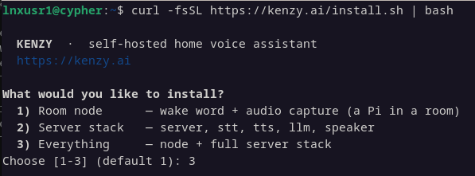
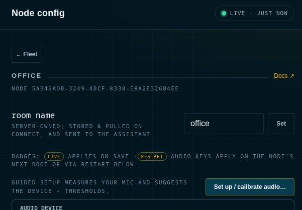

# Part 1 — First Conversation

**Goal:** Let's start with the basics first and get Kenzy to respond to something simple like *"Hey Kenzy, what time is it?"*

**You'll need** the checklist from the [setup overview](../getting-started.md):
a Linux computer, a microphone/speaker (ideally a USB speakerphone), and a
language model for the "thinking" — this guide uses the OpenAI default, but
any compatible provider or a local model works
([details](../configuration/llm.md)).

## 1. Basic install

Plug in your speakerphone first (so setup can find it), then run:

```bash
curl -fsSL https://kenzy.ai/install.sh | bash
```



**Pick what fits your setup:**

| | Choose it when | |
|---|---|---|
| **1) Room node** | This machine is a device in a room — a mic and speaker, nothing else | Needs a server to exist first |
| **2) Server stack** | This machine does the thinking, but you'll listen and speak somewhere else | Install a room node afterwards, on that other machine |
| **3) Everything** | This machine is both — the simplest way to start | |

If your microphone and speaker are plugged into the same computer that will do
the thinking, **choose 3** and you're done in one pass. If they're on different
machines — say a mini-PC in a cupboard and a speakerphone in the kitchen —
install the **server stack** first, then run the same command on the room
machine and choose **room node**. The rest of this guide is written for a single
machine; with two, everything is the same except that the audio steps happen on
the room machine.

Whichever you pick, the installer:

- creates a private Python environment and installs Kenzy from [PyPI](https://pypi.org/project/kenzy/),
- downloads the wake-word and voice-identification models,
- creates your **config home** at `~/.config/kenzy` (all your settings live there),
- sets the services to start automatically, and starts them now.

A server install prints a **join token** near the end — the password room
devices use to connect. You don't need to copy it now; the dashboard can show it
to you any time. (A room node asks you to paste it.)

## 2. Open the dashboard

In a browser on the same network, open:

```
https://localhost:8770

(or https://<the-computer's-IP>:8770 from another machine)
```

The one-line installer enables TLS by default and generates a self-signed
certificate, so your browser will show a one-time warning.

Log in with **`admin` / `password`**.

!!! note "✓ Checkpoint"
    You should see the **fleet view**: a card for this computer's room node, and
    health indicators for the four backend services (STT, TTS, LLM, Speaker) — all
    green within a minute or so of starting. If a service shows unhealthy or the
    page won't load, see [Troubleshooting](../troubleshooting.md#a-service-shows-unhealthy-in-the-dashboard).

Two things to do while you're here:

1. **Change the password** — Settings → change password. The dashboard is reachable
   from your whole network by default, so don't leave it on the default login.
2. **Name your room** — open the node's **Configure** page and set its room name
   (e.g. "office"). Kenzy uses room names in conversation and for announcements.

## 3. Connect the language model

Kenzy needs a large language model — her "brain." Any compatible provider
works: a third-party service (OpenAI, Claude, OpenRouter, …) or a model
running on your own hardware (Ollama). **This guide follows the installer's
default, OpenAI**, purely because it's the fastest route to a working setup —
one key, no downloads. Using something else?  **[Setting Up the Language Model](../configuration/llm.md)**.

!!! note "Wait — isn't Kenzy supposed to be local?"
    It is — every stage can run on your own hardware, and we're only using a 
    cloud brain because it's the easiest way to get you started.  You can
    switch providers and bring it local when you're ready.  Setting up a
    local LLM is a bit more involved, but we're here for you.  Check out
    [Running Fully Local](../fully-local.md#configuring-the-brain-the-llm) for
    more information.

!!! tip "The installer already asked"
    Newer installs ask this question during setup — provider chosen, key
    pasted, done. If that was you, skip ahead to the next step.

Okay, fine print out of the way.  If you're using OpenAI (or most cloud providers) then you'll need to grab an API key from your provider's account page — for OpenAI that's:<br />→ [platform.openai.com](https://platform.openai.com) → **API keys** → **create**

Give it to Kenzy right in the dashboard:

2. Set the API key (if needed)
    * Go to **Settings**
    * Scroll down to **API keys** 
    * Find the `OPENAI_API_KEY` entry and paste in your key
    * **Save**. 
3. Restart the services
    * **Services** tab
    * **Restart** the `llm` and `tts` services (so they recognize your key change).

!!! tip "Prefer the terminal?"
    Edit the text file `~/.config/kenzy/.env` and set `OPENAI_API_KEY` there.<br />Restart the services with `systemctl --user restart 'kenzy-*'`

## 4. Calibrate the audio

Every room, mic, and speaker is different — the default listening thresholds
are almost never *your* room's. Two minutes in the dashboard fixes that, and
it's also how Kenzy learns one important fact about your hardware.



On the node's **Configure** page:

1. **Check the audio device.** The "Audio device" section lists what the node
   detected — make sure your speakerphone is selected (not a webcam mic or
   HDMI output). Picking a device also fills in its supported sample rates.
2. Run **Set up / calibrate audio…** and follow the prompts: a few seconds of
   quiet so she can measure your room's background noise, then say the wake
   word a few times so she can hear how *you* sound from where you actually
   stand. She applies the measured thresholds herself — no numbers to guess.

!!! warning "Configuration"
    It is strongly advised to use Kenzy with a speakerphone that has automatic echo cancelling or **AEC** for the best experience.

!!! note "✓ Checkpoint"
    Calibration finishes with a spoken/on-screen confirmation and asks you to
    try the wake word — a live check that the new settings actually hear you.
    Details on every phase: [calibrating a node's audio](../dashboard.md#calibrating-a-nodes-audio).

## 5. Say hello

Now talk to it. Say:

> **"Hey Kenzie"** … *(you'll hear a chime)* … **"what time is it?"**

!!! note "✓ Checkpoint"
    Chime after the wake word, spoken answer a moment later. If there's no chime,
    see [Kenzy doesn't hear the wake word](../troubleshooting.md#kenzy-doesnt-hear-the-wake-word);
    if it chimes but never answers, see
    [It hears me but never replies](../troubleshooting.md#it-hears-me-but-never-replies).

**That's a working Kenzy.** Everything below is optional.


**Where you are:** a working Kenzy in one room. When you're ready for
more rooms — and for her to know *who's* talking —
**[Continue](part2-rooms-and-people.md)** to **[Part 2 — People & Rooms](part2-rooms-and-people.md)**.
