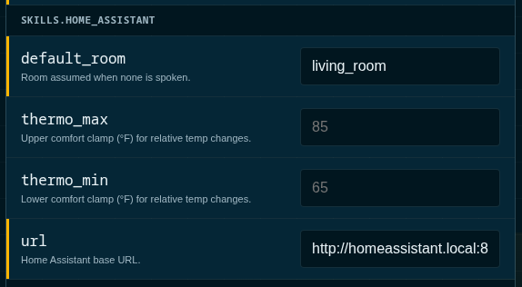

# Part 3 — Home Assistant Basics

**Goal:** If you are using [Home Assistant](https://www.home-assistant.io/) then you can have Kenzy control your devices with your voice commands.

*Note:* Make sure you have completed the prerequisite in [Part 1](part1-first-conversation.md) 

Kenzy reads your device inventory **live from HA** — names, rooms, floors.
While there's no required device list to maintain on the Kenzy side, you can add [notes about devices](./part3-home-assistant.md#4-when-a-device-answers-to-the-wrong-name) to help Kenzy better understand your home.  You can add things like "The floor lamp beside the chair" for example as context to help Kenzy determine the device that best matches your voice command.

## 1. Create a Home Assistant access token

Kenzy authenticates to HA with a **long-lived access token** — a key you
create once, in your HA user profile:

1. Open Home Assistant and click your **user initials** (bottom-left of the
   sidebar) to open your profile.
2. Go to the **Security** tab and scroll to **Long-lived access tokens**.
3. Click **Create token**, name it `kenzy`, and click OK.
4. **Copy the token now** — HA shows it exactly once. If you lose it, delete
   it and create another; nothing breaks.

!!! tip "Use an account that can see your devices"
    The token inherits the permissions of the HA user who creates it. A
    normal admin account is fine.

## 2. Give the token to Kenzy

In the Kenzy dashboard: **Settings → API keys** → set `HA_API_KEY` to the
token you copied. Then tell Kenzy where HA lives, in the LLM service's config
(**Fleet → llm** in the dashboard, or `configs/services/llm.yaml`):



```yaml
skills:
  home_assistant:
    url: "http://homeassistant.local:8123"   # your HA address
```

**Save** your settings and then Restart the LLM service (**Fleet → llm → Restart**) so it picks both up.
The default `url` already says `homeassistant.local:8123` — if that's where
your HA answers, the token alone is enough.

!!! note "✓ Checkpoint"
    The dashboard's **Home Assistant** tab now shows your device tree —
    every area and entity Kenzy can hear about. If it says HA is unreachable,
    check the URL (try your HA's IP address instead of `.local`) and that the
    token was saved.

## 3. Talk to your house

> "Hey Kenzie… **turn off the office lights**"
>
> "Hey Kenzie… **set the bedroom to 72**"
>
> "Hey Kenzie… **is the garage door open?**"

Room awareness is automatic: in the kitchen, "turn on the lights" means the
kitchen lights. Common commands run on a fast deterministic path (no language
model involved — they're instant); anything fuzzier falls through to the
model, which has the same device controls as tools.

If you use HA's **to-do lists**, they work by voice too — "add milk to the
shopping list" — and show up on everyone's phone via the HA companion app.

!!! note "✓ Checkpoint"
    Lights respond by voice, and the **Activity** tab shows the commands with
    a ⚡ fast-path tag.

## 4. When a device answers to the wrong name

Two minutes of curation fixes most annoyances, from the dashboard's **Home
Assistant** tab: give a device a spoken **alias** ("the big lamp"), **exclude**
things that shouldn't be voice-targets (a smart-plug status LED that shows up
as a `light`), or set a room's **defaults** (what "the lights" means in that
room). Details: [Home Assistant skill](../skills/home-assistant.md).

-----

**[Continue](part4-ha-complete.md)** to **[Part 4 — Home Assistant, the Works](part4-ha-complete.md)** —
Kenzy on your phone, in her own voice, and Kenzy's rooms appearing inside HA.
